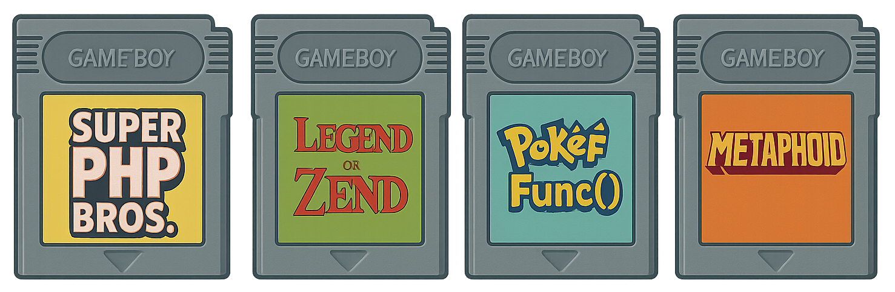
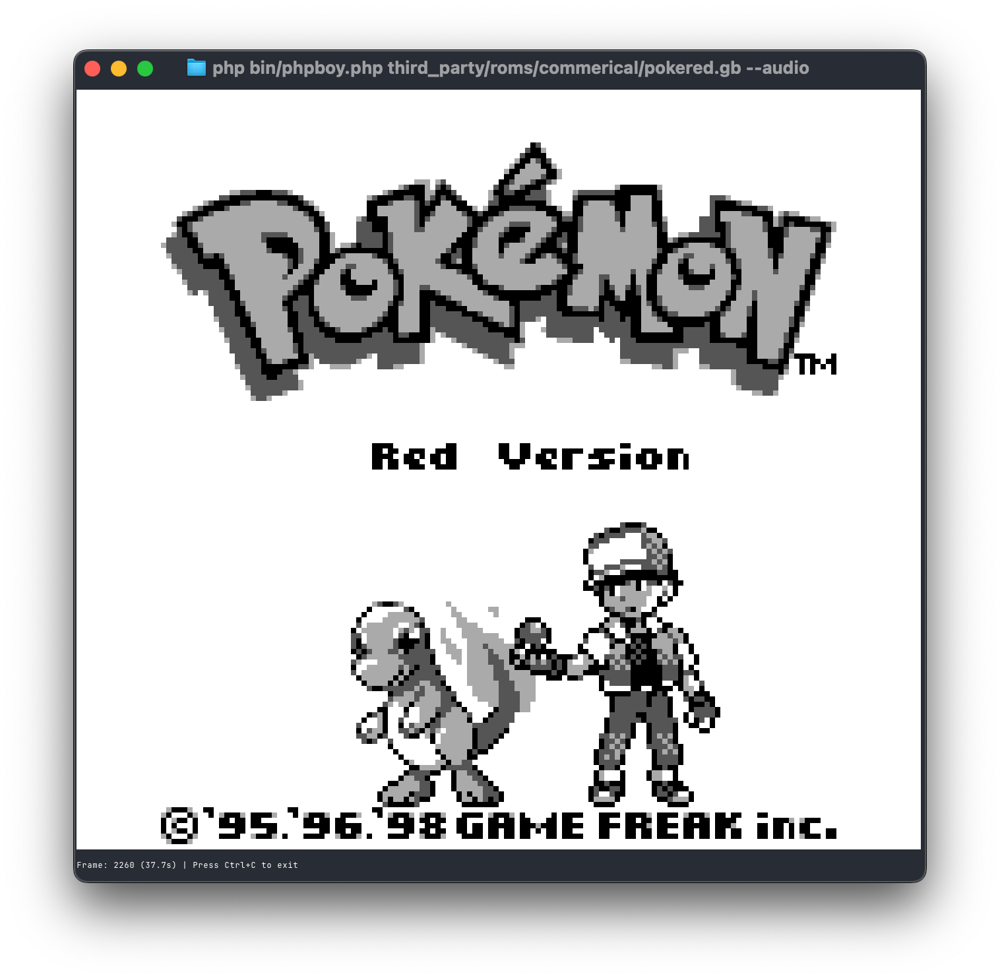
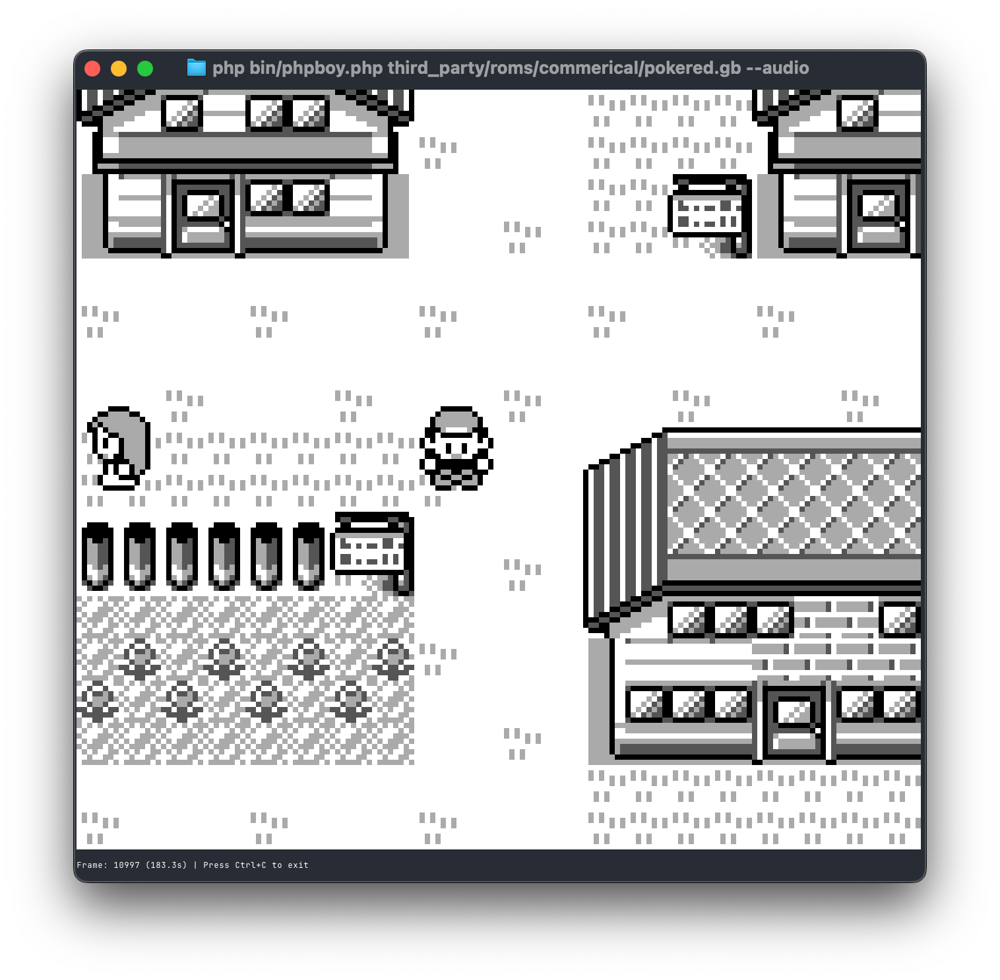

<p align="center">
  
</p>

Game Boy Color emulator written in PHP 8.4. Includes CLI terminal frontend, browser WebAssembly frontend (WIP), and native SDL2 desktop (WIP).

## Current Status

**Note: Color support is WIP (Work in Progress)**

Game Boy Color emulator with backward compatibility for DMG (original Game Boy) games:

- ✅ CLI Terminal Frontend: Fully working, 25-30 FPS baseline, 60+ FPS with PHP JIT enabled
- ✅ GBC Emulation: Complete CPU, PPU with color support, memory bus, input, and cartridge support (MBC1/MBC3/MBC5)
- ✅ Color Support: Full GBC color palette system with 15-bit RGB color, background/sprite palettes, and palette RAM
- ✅ DMG Compatibility: Full backward compatibility mode for original Game Boy games
- ✅ Test Accuracy: Passes Blargg's CPU instruction tests (11/11)
- ✅ Commercial ROMs: Tetris (GBC), Pokemon Red, Zelda DX run with color support
- ✅ Browser (WASM): Renderer works but very slow due to WASM overhead
- 🔄 Audio: APU implemented, working on output integration (CLI/SDL2/WASM)
- 🔄 Mooneye Test Suite: Working on full support (10/39 currently passing)
- 🔄 Acid Tests: Working on dmg-acid2/cgb-acid2 support
- 🔄 SDL2 Native Desktop: Work in progress

<p align="center">
  
</p>

<p align="center">
  
  
</p>

## Features

- PHP 8.4: Uses strict types, readonly properties, enums, typed class constants, and property hooks
- Performance: 60+ FPS with PHP JIT enabled
- Game Boy Color Support:
  - 15-bit RGB color system (32,768 colors)
  - Background and sprite color palettes
  - Color palette RAM with auto-increment
  - VRAM bank switching
  - DMG backward compatibility mode
- Multiple Frontends:
  - CLI Terminal ✅: ANSI color rendering, primary frontend
  - Browser (WebAssembly) ✅: Runs via php-wasm (slow performance)
  - SDL2 Native Desktop 🔄: WIP
- Test Coverage: Passes Blargg's CPU instruction tests (11/11)
- Development: Docker-based workflow with PHPUnit 10 and PHPStan level 9
- Architecture: Modular design with separate namespaces for CPU, PPU, APU, Bus, and Frontend

## Requirements

- Docker
- Docker Compose
- Make (for convenient task automation)

## Getting Started

### Initial Setup

1. Clone the repository:

```bash
git clone <repository-url>
cd phpboy
```

2. Build the Docker image:

```bash
make setup
```

3. Install PHP dependencies:

```bash
make install
```

### Running Game Boy / Game Boy Color ROMs

The CLI terminal frontend is the primary way to run PHPBoy. It supports both DMG (original Game Boy) and GBC (Game Boy Color) ROMs:

```bash
# Run with CLI frontend (JIT enabled by default for 60+ FPS)
make run ROM=path/to/rom.gb    # DMG games
make run ROM=path/to/rom.gbc   # GBC games

# Run without JIT for baseline performance testing (25-30 FPS)
make run-no-jit ROM=path/to/rom.gb
```

CLI Controls:

- Arrow Keys: D-pad
- Z: A button
- X: B button
- Enter: Start
- Shift: Select
- Q: Quit

### Development Workflow

All development tasks are managed through the Makefile and run inside Docker containers.

#### Available Commands

- `make help` - Show available commands
- `make setup` - Build Docker image with PHP 8.4
- `make rebuild` - Rebuild Docker image from scratch (no cache)
- `make install` - Install Composer dependencies in Docker
- `make test` - Run PHPUnit tests in Docker
- `make lint` - Run PHPStan static analysis in Docker
- `make shell` - Open bash shell in Docker container
- `make run ROM=path/to/rom.gb` - Run emulator with JIT enabled (60+ FPS) - supports .gb and .gbc files
- `make run-no-jit ROM=path/to/rom.gb` - Run emulator without JIT (25-30 FPS baseline)
- `make build-wasm` - Build WebAssembly version for browser
- `make serve-wasm` - Serve WASM build locally on port 8080
- `make clean` - Remove vendor directory and composer.lock
- `make clean-docker` - Remove Docker containers and images

#### Running Tests

```bash
make test
```

#### Static Analysis

```bash
make lint
```

#### Opening a Shell

For debugging or manual operations:

```bash
make shell
```

## Performance

Performance with PHP 8.4's JIT compiler:

- Baseline (no JIT): 25-30 FPS
- With JIT enabled: 60+ FPS
- Commercial ROMs: Tetris (GBC), Pokemon Red, Zelda DX run at target speed
- GBC Mode: Color rendering included

The JIT compiler provides approximately 2-3x performance improvement.

## Additional Frontends

### Running in the Browser (WebAssembly)

Browser version via WebAssembly using [php-wasm](https://github.com/seanmorris/php-wasm).

Note: WASM frontend has significant performance overhead. Audio is work in progress.

#### Build for Browser

1. Build the WASM distribution:

```bash
make build-wasm
```

2. Serve locally:

```bash
make serve-wasm
```

3. Open `http://localhost:8080` in your browser

4. Load a ROM file and play!

Features:

- ✅ Runs in browser, no backend required
- ✅ Keyboard controls, speed control, pause/resume
- 🔄 Audio output integration in progress
- ⚠️ Performance: Slow due to WASM overhead

Browser Requirements:

- Chrome 90+, Firefox 88+, Safari 14+, or Edge 90+
- WebAssembly support required

Documentation:

- [WASM Build Guide](docs/wasm-build.md) - How to build and deploy
- [Browser Usage Guide](docs/browser-usage.md) - How to use in browser
- [WASM Options Evaluation](docs/wasm-options.md) - Technical decisions

### Running with SDL2 Native Frontend (Work in Progress)

Experimental native desktop rendering using SDL2.

Status: 🔄 Work in progress - code implemented but not fully tested/integrated.

Documentation:

- [SDL2 Setup Guide](docs/sdl2-setup.md) - Installation instructions
- [SDL2 Usage Guide](docs/sdl2-usage.md) - Usage and customization

## Testing & Accuracy

Test ROM results:

### Test Suite Results

- ✅ Blargg's CPU Instruction Tests: 11/11 passing (100%)
  - `cpu_instrs` - All CPU instructions validated
  - `instr_timing` - Instruction timing accuracy verified
- 🔄 Mooneye Test Suite: 10/39 passing - working on full support
  - Focus on improving timing accuracy for remaining tests
- 🔄 Acid Tests: Working on dmg-acid2/cgb-acid2 support
  - PPU rendering accuracy improvements in progress

See `docs/test-results.md` for detailed test results.

## License

MIT License
